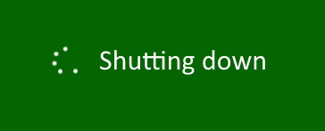
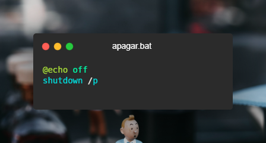

# Turn off shortcut

## Description
Shortcut to turn your computer off.

## Usage
Just double click on "Apagar" and your computer will shut down.

It is recommended to create a shortcut using the image called "turn-off.png".

## Script inside apagar.bat

## More info
In Spanish - [Cómo usar shutdown](https://www.ionos.es/digitalguide/servidores/configuracion/shutdown-con-cmd/)

## Resources
- 
Icon made by <a href="https://www.freepik.com" title="Freepik">Freepik</a> from <a href="https://www.flaticon.com/" title="Flaticon">www.flaticon.com</a>

- [Background imgage](https://images.unsplash.com/photo-1565993545587-f0a82a0d09b9) by Eugene [Chystiakov](https://unsplash.com/@eugenechystiakov)

- Source code image made with [Carbon](https://carbon.now.sh/)

